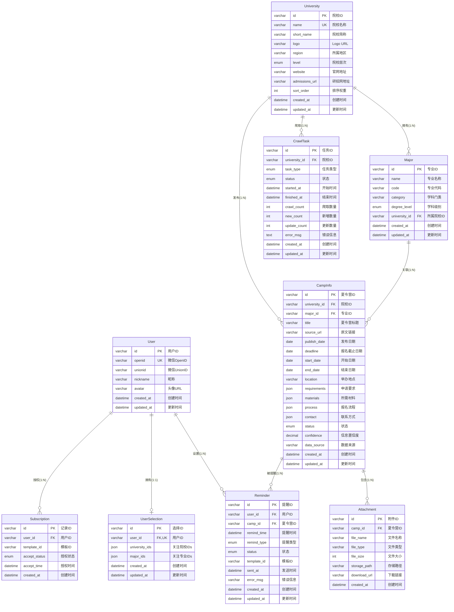
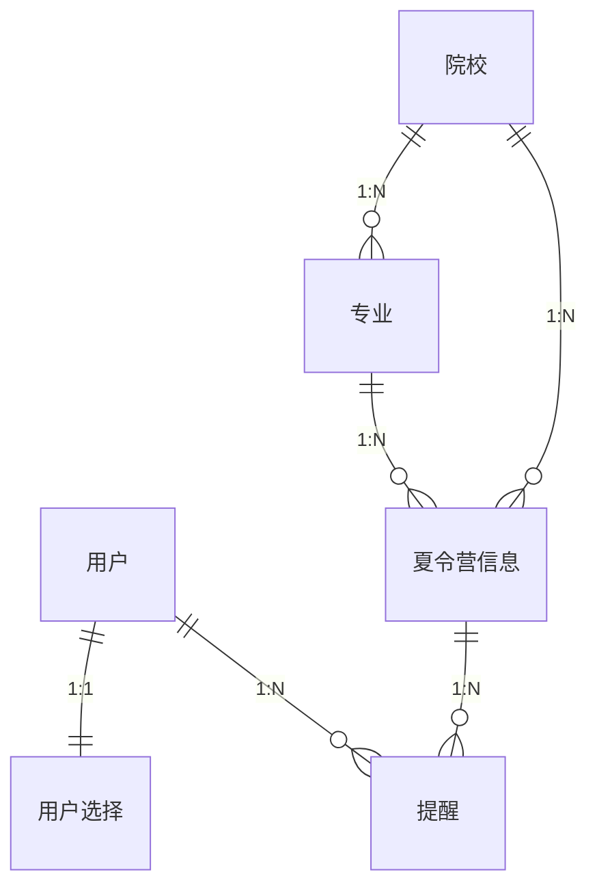

# 保研信息助手小程序 - 领域建模文档

**版本**: v1.0  
**日期**: 2026-02-24  
**状态**: 待评审

---

## 1. 业务实体识别

### 1.1 实体识别方法论

基于以下维度识别业务实体：
- **业务核心性**: 实体是否承载核心业务价值
- **独立存在性**: 实体是否可独立于其他实体存在
- **属性完整性**: 实体是否拥有足够的属性支撑业务
- **生命周期**: 实体是否有独立的生命周期和状态流转

### 1.2 核心业务实体清单

| 实体编号 | 实体名称 | 英文名称 | 业务定义 | 来源文档 |
|----------|----------|----------|----------|----------|
| E-01 | 用户 | User | 使用小程序的保研学生，通过微信授权登录 | PRD 3.1 |
| E-02 | 院校 | University | 招收保研学生的高等院校，如985/211/双一流等 | PRD 3.1 |
| E-03 | 专业 | Major | 院校下属的招生专业，按学科门类分类 | PRD 3.1 |
| E-04 | 夏令营信息 | CampInfo | 院校发布的保研夏令营招生公告信息 | PRD 3.1 |
| E-05 | 用户选择 | UserSelection | 用户关注的目标院校和专业组合 | PRD 3.1 |
| E-06 | 提醒 | Reminder | 用户设置的夏令营截止日期提醒 | PRD 3.1 |

### 1.3 扩展业务实体清单

| 实体编号 | 实体名称 | 英文名称 | 业务定义 | 设计依据 |
|----------|----------|----------|----------|----------|
| E-07 | 附件 | Attachment | 夏令营相关的通知文件、申请表等 | 支持文件下载功能 |
| E-08 | 订阅记录 | Subscription | 用户对微信订阅消息的授权记录 | 支持消息推送功能 |
| E-09 | 爬虫任务 | CrawlTask | 数据采集任务的执行记录 | 支持爬虫监控 |

---

## 2. 实体标准化命名

### 2.1 命名规范

| 规范类型 | 规则说明 | 示例 |
|----------|----------|------|
| 中文名称 | 业务领域通用术语，简洁明确 | 用户、院校、专业 |
| 英文名称 | 大驼峰命名法，单数形式 | User, University, Major |
| 数据库表名 | 小写+下划线，复数形式 | users, universities, majors |
| 字段名 | 小写+下划线，语义清晰 | user_id, university_name |
| 主键命名 | 表名单数 + _id | user_id, university_id |

### 2.2 实体名称映射表

| 中文名称 | 英文名称 | 数据库表名 | 主键字段 | 外键字段 |
|----------|----------|------------|----------|----------|
| 用户 | User | users | id | - |
| 院校 | University | universities | id | - |
| 专业 | Major | majors | id | university_id |
| 夏令营信息 | CampInfo | camp_infos | id | university_id, major_id |
| 用户选择 | UserSelection | user_selections | id | user_id |
| 提醒 | Reminder | reminders | id | user_id, camp_id |
| 附件 | Attachment | attachments | id | camp_id |
| 订阅记录 | Subscription | subscriptions | id | user_id |
| 爬虫任务 | CrawlTask | crawl_tasks | id | university_id |

### 2.3 跨表字段名称一致性

| 业务概念 | 标准字段名 | 使用表 | 数据类型 | 说明 |
|----------|------------|--------|----------|------|
| 用户标识 | user_id | users, user_selections, reminders, subscriptions | VARCHAR(32) | 用户唯一标识 |
| 院校标识 | university_id | universities, majors, camp_infos, user_selections, crawl_tasks | VARCHAR(32) | 院校唯一标识 |
| 专业标识 | major_id | majors, camp_infos, user_selections | VARCHAR(32) | 专业唯一标识 |
| 夏令营标识 | camp_id | camp_infos, reminders, attachments | VARCHAR(32) | 夏令营唯一标识 |
| 创建时间 | created_at | 所有表 | DATETIME | 记录创建时间 |
| 更新时间 | updated_at | 所有表 | DATETIME | 记录更新时间 |
| 状态 | status | camp_infos, reminders, crawl_tasks | ENUM | 实体状态 |

---

## 3. 实体属性定义

### 3.1 用户实体

| 属性编号 | 属性名称 | 英文名称 | 数据类型 | 长度 | 必填 | 默认值 | 业务说明 |
|----------|----------|----------|----------|------|------|--------|----------|
| U-01 | 用户ID | id | VARCHAR | 32 | 是 | - | 主键，UUID格式 |
| U-02 | 微信OpenID | openid | VARCHAR | 64 | 是 | - | 微信用户唯一标识 |
| U-03 | 微信UnionID | unionid | VARCHAR | 64 | 否 | NULL | 微信开放平台统一标识 |
| U-04 | 昵称 | nickname | VARCHAR | 50 | 否 | NULL | 用户昵称(可选) |
| U-05 | 头像 | avatar | VARCHAR | 255 | 否 | NULL | 用户头像URL(可选) |
| U-06 | 创建时间 | created_at | DATETIME | - | 是 | CURRENT_TIMESTAMP | 首次登录时间 |
| U-07 | 更新时间 | updated_at | DATETIME | - | 是 | CURRENT_TIMESTAMP | 最后更新时间 |

**业务约束**:
- openid 全局唯一，不可为空
- 一个openid对应一个用户，不可重复注册

### 3.2 院校实体

| 属性编号 | 属性名称 | 英文名称 | 数据类型 | 长度 | 必填 | 默认值 | 业务说明 |
|----------|----------|----------|----------|------|------|--------|----------|
| UN-01 | 院校ID | id | VARCHAR | 32 | 是 | - | 主键，UUID格式 |
| UN-02 | 院校名称 | name | VARCHAR | 100 | 是 | - | 院校全称 |
| UN-03 | 院校简称 | short_name | VARCHAR | 50 | 否 | NULL | 院校简称 |
| UN-04 | 院校Logo | logo | VARCHAR | 255 | 否 | NULL | 院校Logo URL |
| UN-05 | 所属地区 | region | VARCHAR | 20 | 否 | NULL | 华北/华东/华南等 |
| UN-06 | 院校层次 | level | ENUM | - | 否 | NULL | 985/211/双一流/普通 |
| UN-07 | 官网地址 | website | VARCHAR | 255 | 否 | NULL | 院校官网URL |
| UN-08 | 研招网地址 | admissions_url | VARCHAR | 255 | 否 | NULL | 研究生招生网URL |
| UN-09 | 排序权重 | sort_order | INT | - | 否 | 0 | 列表排序权重 |
| UN-10 | 创建时间 | created_at | DATETIME | - | 是 | CURRENT_TIMESTAMP | - |
| UN-11 | 更新时间 | updated_at | DATETIME | - | 是 | CURRENT_TIMESTAMP | - |

**业务约束**:
- name 全局唯一，不可重复
- level 枚举值: '985', '211', '双一流', '普通'

### 3.3 专业实体

| 属性编号 | 属性名称 | 英文名称 | 数据类型 | 长度 | 必填 | 默认值 | 业务说明 |
|----------|----------|----------|----------|------|------|--------|----------|
| M-01 | 专业ID | id | VARCHAR | 32 | 是 | - | 主键，UUID格式 |
| M-02 | 专业名称 | name | VARCHAR | 100 | 是 | - | 专业全称 |
| M-03 | 专业代码 | code | VARCHAR | 20 | 否 | NULL | 教育部专业代码 |
| M-04 | 学科门类 | category | VARCHAR | 50 | 否 | NULL | 工学/理学/文学等 |
| M-05 | 学科级别 | degree_level | ENUM | - | 否 | 'master' | master/phd |
| M-06 | 所属院校ID | university_id | VARCHAR | 32 | 是 | - | 外键，关联院校 |
| M-07 | 创建时间 | created_at | DATETIME | - | 是 | CURRENT_TIMESTAMP | - |
| M-08 | 更新时间 | updated_at | DATETIME | - | 是 | CURRENT_TIMESTAMP | - |

**业务约束**:
- 同一院校下专业名称不可重复
- university_id 必须存在于 universities 表

### 3.4 夏令营信息实体

| 属性编号 | 属性名称 | 英文名称 | 数据类型 | 长度 | 必填 | 默认值 | 业务说明 |
|----------|----------|----------|----------|------|------|--------|----------|
| C-01 | 夏令营ID | id | VARCHAR | 32 | 是 | - | 主键，UUID格式 |
| C-02 | 院校ID | university_id | VARCHAR | 32 | 是 | - | 外键，关联院校 |
| C-03 | 专业ID | major_id | VARCHAR | 32 | 否 | NULL | 外键，关联专业(可为空) |
| C-04 | 夏令营标题 | title | VARCHAR | 255 | 是 | - | 夏令营公告标题 |
| C-05 | 原文链接 | source_url | VARCHAR | 500 | 是 | - | 官网原文URL |
| C-06 | 发布日期 | publish_date | DATE | - | 否 | NULL | 官网发布日期 |
| C-07 | 报名截止日期 | deadline | DATE | - | 否 | NULL | 报名截止时间 |
| C-08 | 夏令营开始日期 | start_date | DATE | - | 否 | NULL | 夏令营开始时间 |
| C-09 | 夏令营结束日期 | end_date | DATE | - | 否 | NULL | 夏令营结束时间 |
| C-10 | 举办地点 | location | VARCHAR | 255 | 否 | NULL | 夏令营举办地点 |
| C-11 | 申请要求 | requirements | JSON | - | 否 | NULL | 结构化申请要求 |
| C-12 | 所需材料 | materials | JSON | - | 否 | NULL | 材料清单数组 |
| C-13 | 报名流程 | process | JSON | - | 否 | NULL | 流程步骤数组 |
| C-14 | 联系方式 | contact | JSON | - | 否 | NULL | 联系人信息 |
| C-15 | 状态 | status | ENUM | - | 是 | 'published' | draft/published/expired |
| C-16 | 信息置信度 | confidence | DECIMAL | 3,2 | 否 | 1.00 | AI提取置信度0-1 |
| C-17 | 数据来源 | data_source | VARCHAR | 50 | 否 | 'crawler' | crawler/manual/import |
| C-18 | 创建时间 | created_at | DATETIME | - | 是 | CURRENT_TIMESTAMP | - |
| C-19 | 更新时间 | updated_at | DATETIME | - | 是 | CURRENT_TIMESTAMP | - |

**requirements JSON结构**:
```json
{
  "education": "本科在读",
  "gpa": "前30%",
  "english": "CET-6 450分以上",
  "major": "计算机相关专业",
  "other": ["有科研经历优先"]
}
```

**materials JSON结构**:
```json
[
  "个人简历",
  "成绩单",
  "英语成绩证明",
  "获奖证书",
  "推荐信"
]
```

**process JSON结构**:
```json
[
  {"step": 1, "action": "网上报名", "deadline": "2024-05-30"},
  {"step": 2, "action": "提交材料", "deadline": "2024-06-05"},
  {"step": 3, "action": "等待审核", "note": "预计7个工作日"}
]
```

### 3.5 用户选择实体

| 属性编号 | 属性名称 | 英文名称 | 数据类型 | 长度 | 必填 | 默认值 | 业务说明 |
|----------|----------|----------|----------|------|------|--------|----------|
| US-01 | 选择ID | id | VARCHAR | 32 | 是 | - | 主键，UUID格式 |
| US-02 | 用户ID | user_id | VARCHAR | 32 | 是 | - | 外键，关联用户 |
| US-03 | 关注院校IDs | university_ids | JSON | - | 否 | NULL | 院校ID数组 |
| US-04 | 关注专业IDs | major_ids | JSON | - | 否 | NULL | 专业ID数组 |
| US-05 | 创建时间 | created_at | DATETIME | - | 是 | CURRENT_TIMESTAMP | - |
| US-06 | 更新时间 | updated_at | DATETIME | - | 是 | CURRENT_TIMESTAMP | - |

**业务约束**:
- 一个用户只有一条选择记录
- user_id 唯一约束

### 3.6 提醒实体

| 属性编号 | 属性名称 | 英文名称 | 数据类型 | 长度 | 必填 | 默认值 | 业务说明 |
|----------|----------|----------|----------|------|------|--------|----------|
| R-01 | 提醒ID | id | VARCHAR | 32 | 是 | - | 主键，UUID格式 |
| R-02 | 用户ID | user_id | VARCHAR | 32 | 是 | - | 外键，关联用户 |
| R-03 | 夏令营ID | camp_id | VARCHAR | 32 | 是 | - | 外键，关联夏令营 |
| R-04 | 提醒时间 | remind_time | DATETIME | - | 是 | - | 计划提醒时间 |
| R-05 | 提醒类型 | remind_type | ENUM | - | 否 | 'deadline' | deadline/custom |
| R-06 | 状态 | status | ENUM | - | 是 | 'pending' | pending/sent/failed/expired |
| R-07 | 模板ID | template_id | VARCHAR | 50 | 否 | NULL | 微信订阅消息模板ID |
| R-08 | 发送时间 | sent_at | DATETIME | - | 否 | NULL | 实际发送时间 |
| R-09 | 错误信息 | error_msg | VARCHAR | 255 | 否 | NULL | 发送失败原因 |
| R-10 | 创建时间 | created_at | DATETIME | - | 是 | CURRENT_TIMESTAMP | - |
| R-11 | 更新时间 | updated_at | DATETIME | - | 是 | CURRENT_TIMESTAMP | - |

**业务约束**:
- 同一用户对同一夏令营可设置多个提醒
- remind_time 必须晚于当前时间

### 3.7 附件实体

| 属性编号 | 属性名称 | 英文名称 | 数据类型 | 长度 | 必填 | 默认值 | 业务说明 |
|----------|----------|----------|----------|------|------|--------|----------|
| A-01 | 附件ID | id | VARCHAR | 32 | 是 | - | 主键，UUID格式 |
| A-02 | 夏令营ID | camp_id | VARCHAR | 32 | 是 | - | 外键，关联夏令营 |
| A-03 | 文件名称 | file_name | VARCHAR | 255 | 是 | - | 原始文件名 |
| A-04 | 文件类型 | file_type | VARCHAR | 50 | 否 | NULL | MIME类型 |
| A-05 | 文件大小 | file_size | INT | - | 否 | NULL | 文件大小(字节) |
| A-06 | 存储路径 | storage_path | VARCHAR | 500 | 是 | - | OSS存储路径 |
| A-07 | 下载链接 | download_url | VARCHAR | 500 | 否 | NULL | 临时下载URL |
| A-08 | 创建时间 | created_at | DATETIME | - | 是 | CURRENT_TIMESTAMP | - |

### 3.8 订阅记录实体

| 属性编号 | 属性名称 | 英文名称 | 数据类型 | 长度 | 必填 | 默认值 | 业务说明 |
|----------|----------|----------|----------|------|------|--------|----------|
| S-01 | 记录ID | id | VARCHAR | 32 | 是 | - | 主键，UUID格式 |
| S-02 | 用户ID | user_id | VARCHAR | 32 | 是 | - | 外键，关联用户 |
| S-03 | 模板ID | template_id | VARCHAR | 50 | 是 | - | 订阅消息模板ID |
| S-04 | 授权状态 | accept_status | ENUM | - | 是 | - | accept/reject |
| S-05 | 授权时间 | accept_time | DATETIME | - | 是 | CURRENT_TIMESTAMP | 用户授权时间 |
| S-06 | 创建时间 | created_at | DATETIME | - | 是 | CURRENT_TIMESTAMP | - |

### 3.9 爬虫任务实体

| 属性编号 | 属性名称 | 英文名称 | 数据类型 | 长度 | 必填 | 默认值 | 业务说明 |
|----------|----------|----------|----------|------|------|--------|----------|
| CT-01 | 任务ID | id | VARCHAR | 32 | 是 | - | 主键，UUID格式 |
| CT-02 | 院校ID | university_id | VARCHAR | 32 | 是 | - | 外键，关联院校 |
| CT-03 | 任务类型 | task_type | ENUM | - | 是 | - | full/incremental |
| CT-04 | 状态 | status | ENUM | - | 是 | 'pending' | pending/running/success/failed |
| CT-05 | 开始时间 | started_at | DATETIME | - | 否 | NULL | 任务开始时间 |
| CT-06 | 结束时间 | finished_at | DATETIME | - | 否 | NULL | 任务结束时间 |
| CT-07 | 爬取数量 | crawl_count | INT | - | 否 | 0 | 爬取到的记录数 |
| CT-08 | 新增数量 | new_count | INT | - | 否 | 0 | 新增记录数 |
| CT-09 | 更新数量 | update_count | INT | - | 否 | 0 | 更新记录数 |
| CT-10 | 错误信息 | error_msg | TEXT | - | 否 | NULL | 错误详情 |
| CT-11 | 创建时间 | created_at | DATETIME | - | 是 | CURRENT_TIMESTAMP | - |
| CT-12 | 更新时间 | updated_at | DATETIME | - | 是 | CURRENT_TIMESTAMP | - |

---

## 4. 实体关系分析

### 4.1 关系识别矩阵

| 源实体 | 目标实体 | 关系类型 | 关系名称 | 业务说明 |
|--------|----------|----------|----------|----------|
| University | Major | 1:N | 拥有 | 一个院校拥有多个专业 |
| University | CampInfo | 1:N | 发布 | 一个院校发布多个夏令营 |
| Major | CampInfo | 1:N | 关联 | 一个专业关联多个夏令营 |
| User | UserSelection | 1:1 | 拥有 | 一个用户拥有一条选择记录 |
| User | Reminder | 1:N | 设置 | 一个用户设置多个提醒 |
| User | Subscription | 1:N | 授权 | 一个用户多次授权订阅 |
| CampInfo | Reminder | 1:N | 被提醒 | 一个夏令营被多个用户设置提醒 |
| CampInfo | Attachment | 1:N | 包含 | 一个夏令营包含多个附件 |

### 4.2 关系详细定义

#### 4.2.1 院校-专业关系 (1:N)

```
关系名称: 拥有
关系类型: 一对多 (1:N)
源实体: University (1)
目标实体: Major (N)

基数约束:
- 一个院校必须至少有一个专业 (1..*)
- 一个专业必须属于一个院校 (1..1)

外键约束:
- Major.university_id → University.id
- ON DELETE RESTRICT (有专业时不可删除院校)
- ON UPDATE CASCADE

业务规则:
- 院校删除前必须先删除其下所有专业
- 专业创建时必须指定所属院校
```

#### 4.2.2 院校-夏令营关系 (1:N)

```
关系名称: 发布
关系类型: 一对多 (1:N)
源实体: University (1)
目标实体: CampInfo (N)

基数约束:
- 一个院校可发布零个或多个夏令营 (0..*)
- 一个夏令营必须属于一个院校 (1..1)

外键约束:
- CampInfo.university_id → University.id
- ON DELETE RESTRICT (有夏令营时不可删除院校)
- ON UPDATE CASCADE

业务规则:
- 夏令营必须关联院校
- 院校删除前必须先删除其下所有夏令营
```

#### 4.2.3 专业-夏令营关系 (1:N)

```
关系名称: 关联
关系类型: 一对多 (1:N)
源实体: Major (1)
目标实体: CampInfo (N)

基数约束:
- 一个专业可关联零个或多个夏令营 (0..*)
- 一个夏令营可关联零个或一个专业 (0..1)

外键约束:
- CampInfo.major_id → Major.id
- ON DELETE SET NULL (专业删除时夏令营的专业字段置空)
- ON UPDATE CASCADE

业务规则:
- 夏令营的专业关联是可选的
- 部分夏令营面向多个专业，不限定单一专业
```

#### 4.2.4 用户-用户选择关系 (1:1)

```
关系名称: 拥有
关系类型: 一对一 (1:1)
源实体: User (1)
目标实体: UserSelection (1)

基数约束:
- 一个用户最多拥有一条选择记录 (0..1)
- 一条选择记录必须属于一个用户 (1..1)

外键约束:
- UserSelection.user_id → User.id
- UNIQUE约束 (user_id唯一)
- ON DELETE CASCADE (用户删除时选择记录级联删除)
- ON UPDATE CASCADE

业务规则:
- 用户首次选择院校/专业时创建记录
- 后续选择更新同一记录
```

#### 4.2.5 用户-提醒关系 (1:N)

```
关系名称: 设置
关系类型: 一对多 (1:N)
源实体: User (1)
目标实体: Reminder (N)

基数约束:
- 一个用户可设置零个或多个提醒 (0..*)
- 一个提醒必须属于一个用户 (1..1)

外键约束:
- Reminder.user_id → User.id
- ON DELETE CASCADE (用户删除时提醒级联删除)
- ON UPDATE CASCADE

业务规则:
- 用户可对同一夏令营设置多个时间点的提醒
- 用户删除后其所有提醒自动删除
```

#### 4.2.6 夏令营-提醒关系 (1:N)

```
关系名称: 被提醒
关系类型: 一对多 (1:N)
源实体: CampInfo (1)
目标实体: Reminder (N)

基数约束:
- 一个夏令营可被零个或多个用户设置提醒 (0..*)
- 一个提醒必须关联一个夏令营 (1..1)

外键约束:
- Reminder.camp_id → CampInfo.id
- ON DELETE CASCADE (夏令营删除时提醒级联删除)
- ON UPDATE CASCADE

业务规则:
- 夏令营删除后相关提醒自动删除
- 提醒创建时验证夏令营是否存在
```

#### 4.2.7 夏令营-附件关系 (1:N)

```
关系名称: 包含
关系类型: 一对多 (1:N)
源实体: CampInfo (1)
目标实体: Attachment (N)

基数约束:
- 一个夏令营可包含零个或多个附件 (0..*)
- 一个附件必须属于一个夏令营 (1..1)

外键约束:
- Attachment.camp_id → CampInfo.id
- ON DELETE CASCADE (夏令营删除时附件级联删除)
- ON UPDATE CASCADE

业务规则:
- 附件随夏令营删除而删除
- OSS文件需单独清理
```

#### 4.2.8 用户-订阅记录关系 (1:N)

```
关系名称: 授权
关系类型: 一对多 (1:N)
源实体: User (1)
目标实体: Subscription (N)

基数约束:
- 一个用户可授权零次或多次 (0..*)
- 一条订阅记录必须属于一个用户 (1..1)

外键约束:
- Subscription.user_id → User.id
- ON DELETE CASCADE (用户删除时订阅记录级联删除)
- ON UPDATE CASCADE

业务规则:
- 每次用户授权订阅消息时记录一次
- 用于统计用户可用订阅次数
```

---

## 5. 实体关系图 (ER图)

### 5.1 Mermaid ER图代码



### 5.2 简化版ER图 (核心实体)



---

## 6. 实体字段映射关系

### 6.1 外键映射表

| 子表 | 外键字段 | 父表 | 父表字段 | 关系类型 | 删除策略 | 更新策略 |
|------|----------|------|----------|----------|----------|----------|
| majors | university_id | universities | id | 1:N | RESTRICT | CASCADE |
| camp_infos | university_id | universities | id | 1:N | RESTRICT | CASCADE |
| camp_infos | major_id | majors | id | 1:N | SET NULL | CASCADE |
| user_selections | user_id | users | id | 1:1 | CASCADE | CASCADE |
| reminders | user_id | users | id | 1:N | CASCADE | CASCADE |
| reminders | camp_id | camp_infos | id | 1:N | CASCADE | CASCADE |
| attachments | camp_id | camp_infos | id | 1:N | CASCADE | CASCADE |
| subscriptions | user_id | users | id | 1:N | CASCADE | CASCADE |
| crawl_tasks | university_id | universities | id | 1:N | RESTRICT | CASCADE |

### 6.2 索引设计

| 表名 | 索引名 | 索引字段 | 索引类型 | 业务说明 |
|------|--------|----------|----------|----------|
| users | idx_openid | openid | UNIQUE | 微信登录查询 |
| universities | idx_name | name | UNIQUE | 院校名称唯一 |
| universities | idx_region | region | NORMAL | 按地区筛选 |
| universities | idx_level | level | NORMAL | 按层次筛选 |
| majors | idx_university | university_id | NORMAL | 按院校查询专业 |
| majors | idx_category | category | NORMAL | 按学科门类筛选 |
| camp_infos | idx_university | university_id | NORMAL | 按院校查询夏令营 |
| camp_infos | idx_major | major_id | NORMAL | 按专业查询夏令营 |
| camp_infos | idx_deadline | deadline | NORMAL | 按截止日期排序 |
| camp_infos | idx_status | status | NORMAL | 按状态筛选 |
| user_selections | idx_user | user_id | UNIQUE | 用户选择唯一 |
| reminders | idx_user | user_id | NORMAL | 查询用户提醒 |
| reminders | idx_camp | camp_id | NORMAL | 查询夏令营提醒 |
| reminders | idx_status | status | NORMAL | 按状态筛选 |
| reminders | idx_remind_time | remind_time | NORMAL | 定时任务扫描 |
| attachments | idx_camp | camp_id | NORMAL | 查询夏令营附件 |
| subscriptions | idx_user | user_id | NORMAL | 查询用户订阅 |
| crawl_tasks | idx_university | university_id | NORMAL | 查询院校爬虫任务 |
| crawl_tasks | idx_status | status | NORMAL | 按状态筛选 |

---

## 7. 设计依据与业务考量

### 7.1 核心实体设计依据

#### 7.1.1 用户实体简化设计

**设计决策**: 用户实体仅存储openid，不存储手机号等敏感信息

**业务考量**:
1. **合规性**: 遵循《个人信息保护法》最小必要原则
2. **隐私保护**: 减少用户隐私数据收集，降低数据泄露风险
3. **用户体验**: 微信一键登录，无需额外注册流程
4. **审核友好**: 微信小程序审核对用户数据收集有严格要求

#### 7.1.2 用户选择独立设计

**设计决策**: 用户选择的院校/专业独立为UserSelection实体

**业务考量**:
1. **关注点分离**: 用户基本信息与选择信息解耦
2. **扩展性**: 便于后续扩展更多选择维度(如地区、层次)
3. **查询效率**: 独立表便于建立索引，提升查询性能
4. **数据一致性**: JSON存储数组，避免多表关联查询

#### 7.1.3 夏令营信息JSON字段设计

**设计决策**: requirements/materials/process使用JSON类型存储

**业务考量**:
1. **灵活性**: 不同院校夏令营信息结构差异大，JSON灵活适配
2. **扩展性**: 新增字段无需修改表结构
3. **查询效率**: 这些字段主要用于展示，不作为查询条件
4. **AI提取友好**: AI提取结果可直接存储为JSON格式

#### 7.1.4 专业-夏令营可选关联

**设计决策**: CampInfo.major_id可为空

**业务考量**:
1. **业务现实**: 部分夏令营面向多个专业或全院招生
2. **数据完整性**: 强制关联会导致数据录入困难
3. **查询灵活性**: 可按院校查询，不限定专业

### 7.2 关系设计依据

#### 7.2.1 级联删除策略

**设计决策**: 用户相关数据采用CASCADE删除策略

**业务考量**:
1. **数据一致性**: 用户注销后相关数据自动清理
2. **存储优化**: 避免孤儿数据占用存储空间
3. **合规要求**: 用户有权要求删除个人数据

#### 7.2.2 外键约束策略

**设计决策**: 核心实体间使用RESTRICT策略

**业务考量**:
1. **数据完整性**: 防止误删导致数据不一致
2. **业务逻辑**: 有子数据的实体不可直接删除
3. **错误提示**: 数据库层面约束，应用层友好提示

### 7.3 性能优化考量

#### 7.3.1 索引设计原则

1. **查询优先**: 为高频查询字段建立索引
2. **组合索引**: 多条件查询考虑组合索引
3. **索引选择性**: 选择性高的字段优先建索引
4. **索引维护**: 避免过多索引影响写入性能

#### 7.3.2 JSON字段使用场景

**适用场景**:
- 结构不固定，扩展频繁
- 仅用于展示，不参与查询
- 数据量小，解析开销可控

**不适用场景**:
- 需要作为查询条件
- 需要建立索引
- 数据量大，解析开销高

---

## 8. 数据字典汇总

### 8.1 枚举值定义

| 枚举类型 | 枚举值 | 说明 |
|----------|--------|------|
| University.level | 985 | 985工程院校 |
| University.level | 211 | 211工程院校 |
| University.level | 双一流 | 双一流建设院校 |
| University.level | 普通 | 普通本科院校 |
| Major.degree_level | master | 硕士 |
| Major.degree_level | phd | 博士 |
| CampInfo.status | draft | 草稿 |
| CampInfo.status | published | 已发布 |
| CampInfo.status | expired | 已过期 |
| Reminder.remind_type | deadline | 截止日期提醒 |
| Reminder.remind_type | custom | 自定义提醒 |
| Reminder.status | pending | 待发送 |
| Reminder.status | sent | 已发送 |
| Reminder.status | failed | 发送失败 |
| Reminder.status | expired | 已过期 |
| Subscription.accept_status | accept | 已授权 |
| Subscription.accept_status | reject | 已拒绝 |
| CrawlTask.task_type | full | 全量爬取 |
| CrawlTask.task_type | incremental | 增量爬取 |
| CrawlTask.status | pending | 待执行 |
| CrawlTask.status | running | 执行中 |
| CrawlTask.status | success | 成功 |
| CrawlTask.status | failed | 失败 |

### 8.2 数据类型规范

| 数据类型 | 使用场景 | 示例 |
|----------|----------|------|
| VARCHAR(32) | 主键、外键ID | id, user_id |
| VARCHAR(64) | 唯一标识 | openid |
| VARCHAR(100) | 名称字段 | name |
| VARCHAR(255) | 标题、URL | title, source_url |
| VARCHAR(500) | 长URL、路径 | source_url, storage_path |
| TEXT | 大文本 | error_msg |
| INT | 数量、排序 | crawl_count, sort_order |
| DECIMAL(3,2) | 精确小数 | confidence |
| DATE | 日期 | deadline, publish_date |
| DATETIME | 日期时间 | created_at, remind_time |
| JSON | 结构化数据 | requirements, materials |
| ENUM | 枚举状态 | status, level |

---

**文档结束**
