# 保研信息助手小程序 - 用户流程时序图

**版本**: v1.0  
**日期**: 2026-02-24  
**状态**: 待评审

---

## 1. 系统参与者识别

### 1.1 参与者清单

| 层级 | 参与者 | 角色说明 |
|------|--------|----------|
| **用户层** | 用户 | 保研学生，系统最终使用者 |
| **用户层** | 微信小程序 | 前端应用，用户交互界面 |
| **用户层** | 微信授权服务 | 微信登录认证服务 |
| **用户层** | 微信订阅消息 | 微信消息推送服务 |
| **接入层** | Nginx | 反向代理、负载均衡、HTTPS终结 |
| **服务层** | API服务 | NestJS后端服务，核心业务逻辑 |
| **服务层** | 爬虫服务 | 数据采集与结构化提取服务 |
| **服务层** | 提醒服务 | 定时扫描与消息推送服务 |
| **数据层** | MySQL | 关系型数据库 |
| **数据层** | Redis | 缓存、会话、分布式锁 |
| **数据层** | OSS | 文件存储服务 |
| **外部依赖** | 微信开放平台 | 微信登录、订阅消息API |
| **外部依赖** | 院校官网 | 夏令营信息数据源 |
| **外部依赖** | AI大模型 | DeepSeek，信息结构化提取 |

### 1.2 参与者层级关系

```
用户层: 用户 → 微信小程序 → 微信授权服务 → 微信订阅消息
    ↓
接入层: Nginx
    ↓
服务层: API服务 → 爬虫服务 → 提醒服务
    ↓
数据层: MySQL → Redis → OSS
    ↓
外部依赖: 微信开放平台 → 院校官网 → AI大模型
```

---

## 2. 完整用户流程时序图

### 2.1 Mermaid 流程图代码

```mermaid
graph TD
    subgraph 用户层["👤 用户层"]
        U[("用户<br/>保研学生")]
        MP["微信小程序<br/>前端应用"]
        WX_AUTH["微信授权服务"]
        WX_MSG["微信订阅消息"]
    end

    subgraph 接入层["🔒 接入层"]
        NGINX["Nginx<br/>反向代理"]
    end

    subgraph 服务层["⚙️ 服务层"]
        API["API服务<br/>NestJS"]
        CRAWLER["爬虫服务<br/>Scrapy"]
        REMINDER["提醒服务<br/>BullMQ"]
    end

    subgraph 数据层["💾 数据层"]
        MYSQL[("MySQL<br/>关系数据库")]
        REDIS[("Redis<br/>缓存")]
        OSS[("OSS<br/>文件存储")]
    end

    subgraph 外部依赖["🌐 外部依赖"]
        WX_API["微信开放平台<br/>API"]
        UNIV_WEB["院校官网<br/>数据源"]
        AI["AI大模型<br/>DeepSeek"]
    end

    %% ========== 流程1: 用户注册与登录 ==========
    U -->|"1.1 打开小程序"| MP
    MP -->|"1.2 wx.login()获取code"| WX_AUTH
    WX_AUTH -->|"1.3 返回code"| MP
    MP -->|"1.4 POST /auth/login<br/>{code}"| NGINX
    NGINX -->|"1.5 转发请求"| API
    API -->|"1.6 code2Session"| WX_API
    WX_API -->|"1.7 返回openid"| API
    API -->|"1.8 查询用户"| MYSQL
    MYSQL -->|"1.9 用户不存在"| API
    API -->|"1.10 创建用户"| MYSQL
    MYSQL -->|"1.11 返回用户ID"| API
    API -->|"1.12 生成JWT Token"| REDIS
    REDIS -->|"1.13 Token存储成功"| API
    API -->|"1.14 返回token+用户信息"| NGINX
    NGINX -->|"1.15 返回响应"| MP
    MP -->|"1.16 存储token本地"| MP
    MP -->|"1.17 显示首页"| U

    %% ========== 流程2: 创建并保存目标院校和专业 ==========
    U -->|"2.1 点击选择院校"| MP
    MP -->|"2.2 GET /universities"| NGINX
    NGINX -->|"2.3 转发请求"| API
    API -->|"2.4 查询缓存"| REDIS
    REDIS -->|"2.5 缓存未命中"| API
    API -->|"2.6 查询院校列表"| MYSQL
    MYSQL -->|"2.7 返回院校数据"| API
    API -->|"2.8 写入缓存"| REDIS
    API -->|"2.9 返回院校列表"| MP
    MP -->|"2.10 展示院校列表"| U
    U -->|"2.11 选择院校/专业"| MP
    MP -->|"2.12 POST /user/selections<br/>{universityIds, majorIds}"| NGINX
    NGINX -->|"2.13 转发请求"| API
    API -->|"2.14 验证Token"| REDIS
    REDIS -->|"2.15 Token有效"| API
    API -->|"2.16 保存用户选择"| MYSQL
    MYSQL -->|"2.17 保存成功"| API
    API -->|"2.18 返回选择结果"| MP
    MP -->|"2.19 显示已选择"| U

    %% ========== 流程3: 识别并加载夏令营信息 ==========
    API -.->|"3.1 定时触发爬取"| CRAWLER
    CRAWLER -->|"3.2 获取院校列表"| MYSQL
    MYSQL -->|"3.3 返回院校URL"| CRAWLER
    CRAWLER -->|"3.4 请求官网页面"| UNIV_WEB
    UNIV_WEB -->|"3.5 返回HTML"| CRAWLER
    CRAWLER -->|"3.6 AI辅助提取"| AI
    AI -->|"3.7 返回结构化数据"| CRAWLER
    CRAWLER -->|"3.8 存储夏令营信息"| MYSQL
    MYSQL -->|"3.9 存储成功"| CRAWLER
    CRAWLER -->|"3.10 更新缓存"| REDIS

    %% ========== 流程4: 结构化展示夏令营信息 ==========
    U -->|"4.1 查看夏令营列表"| MP
    MP -->|"4.2 GET /camps<br/>?universityIds=xxx"| NGINX
    NGINX -->|"4.3 转发请求"| API
    API -->|"4.4 查询缓存"| REDIS
    REDIS -->|"4.5 缓存命中/未命中"| API
    API -->|"4.6 [未命中]查询数据库"| MYSQL
    MYSQL -->|"4.7 返回夏令营列表"| API
    API -->|"4.8 写入缓存"| REDIS
    API -->|"4.9 返回夏令营列表"| MP
    MP -->|"4.10 展示夏令营卡片"| U
    U -->|"4.11 点击查看详情"| MP
    MP -->|"4.12 GET /camps/:id"| NGINX
    NGINX -->|"4.13 转发请求"| API
    API -->|"4.14 查询夏令营详情"| MYSQL
    MYSQL -->|"4.15 返回详情数据"| API
    API -->|"4.16 返回结构化信息"| MP
    MP -->|"4.17 结构化展示<br/>申请条件/材料/流程"| U

    %% ========== 流程5: 下载夏令营关键文件 ==========
    U -->|"5.1 点击下载附件"| MP
    MP -->|"5.2 GET /files/:id"| NGINX
    NGINX -->|"5.3 转发请求"| API
    API -->|"5.4 查询文件信息"| MYSQL
    MYSQL -->|"5.5 返回文件URL"| API
    API -->|"5.6 生成临时访问URL"| OSS
    OSS -->|"5.7 返回签名URL"| API
    API -->|"5.8 返回下载链接"| MP
    MP -->|"5.9 调用wx.downloadFile"| MP
    MP -->|"5.10 下载文件"| OSS
    OSS -->|"5.11 返回文件数据"| MP
    MP -->|"5.12 保存到本地"| MP
    MP -->|"5.13 下载完成提示"| U

    %% ========== 流程6: 设置截止时间提醒 ==========
    U -->|"6.1 点击设置提醒"| MP
    MP -->|"6.2 请求订阅授权"| WX_MSG
    WX_MSG -->|"6.3 弹出授权弹窗"| U
    U -->|"6.4 同意授权"| WX_MSG
    WX_MSG -->|"6.5 返回授权结果"| MP
    MP -->|"6.6 POST /reminders<br/>{campId, remindTime}"| NGINX
    NGINX -->|"6.7 转发请求"| API
    API -->|"6.8 验证Token"| REDIS
    REDIS -->|"6.9 Token有效"| API
    API -->|"6.10 创建提醒记录"| MYSQL
    MYSQL -->|"6.11 返回提醒ID"| API
    API -->|"6.12 添加到提醒队列"| REDIS
    API -->|"6.13 返回设置成功"| MP
    MP -->|"6.14 显示提醒已设置"| U

    %% ========== 流程7: 提醒推送 ==========
    REMINDER -.->|"7.1 定时扫描待发送"| REDIS
    REDIS -->|"7.2 返回待发送提醒"| REMINDER
    REMINDER -->|"7.3 查询用户openid"| MYSQL
    MYSQL -->|"7.4 返回openid"| REMINDER
    REMINDER -->|"7.5 发送订阅消息"| WX_API
    WX_API -->|"7.6 推送消息"| WX_MSG
    WX_MSG -->|"7.7 推送到用户微信"| U
    REMINDER -->|"7.8 更新提醒状态"| MYSQL

    %% ========== 样式定义 ==========
    classDef userLayer fill:#e1f5fe,stroke:#01579b,stroke-width:2px
    classDef gatewayLayer fill:#fff3e0,stroke:#e65100,stroke-width:2px
    classDef serviceLayer fill:#e8f5e9,stroke:#1b5e20,stroke-width:2px
    classDef dataLayer fill:#fce4ec,stroke:#880e4f,stroke-width:2px
    classDef externalLayer fill:#f3e5f5,stroke:#4a148c,stroke-width:2px

    class U,MP,WX_AUTH,WX_MSG userLayer
    class NGINX gatewayLayer
    class API,CRAWLER,REMINDER serviceLayer
    class MYSQL,REDIS,OSS dataLayer
    class WX_API,UNIV_WEB,AI externalLayer
```



---

## 3. 流程详细说明

### 3.1 用户注册与登录流程

| 步骤 | 参与者 | 操作 | 说明 |
|------|--------|------|------|
| 1.1 | 用户→小程序 | 打开小程序 | 用户启动微信小程序 |
| 1.2 | 小程序→微信授权 | wx.login() | 调用微信登录API获取临时code |
| 1.3 | 微信授权→小程序 | 返回code | 微信返回临时登录凭证 |
| 1.4 | 小程序→Nginx | POST /auth/login | 发送登录请求 |
| 1.5 | Nginx→API服务 | 转发请求 | 反向代理转发 |
| 1.6 | API服务→微信开放平台 | code2Session | 用code换取openid |
| 1.7 | 微信开放平台→API服务 | 返回openid | 微信返回用户唯一标识 |
| 1.8 | API服务→MySQL | 查询用户 | 根据openid查询用户是否存在 |
| 1.9 | MySQL→API服务 | 用户不存在 | 新用户首次登录 |
| 1.10 | API服务→MySQL | 创建用户 | 创建新用户记录 |
| 1.11 | MySQL→API服务 | 返回用户ID | 用户创建成功 |
| 1.12 | API服务→Redis | 生成JWT Token | 生成并存储Token |
| 1.13 | Redis→API服务 | Token存储成功 | Token存储完成 |
| 1.14-1.17 | 响应链路 | 返回token+用户信息 | 逐层返回响应 |

### 3.2 创建并保存目标院校和专业流程

| 步骤 | 参与者 | 操作 | 说明 |
|------|--------|------|------|
| 2.1 | 用户→小程序 | 点击选择院校 | 进入院校选择页面 |
| 2.2-2.3 | 小程序→API服务 | GET /universities | 请求院校列表 |
| 2.4-2.5 | API服务→Redis | 查询缓存 | 检查缓存是否存在 |
| 2.6-2.8 | API服务→MySQL | 查询并缓存 | 缓存未命中时查询数据库并写入缓存 |
| 2.9-2.10 | API服务→小程序 | 返回院校列表 | 展示院校供用户选择 |
| 2.11-2.19 | 保存选择 | POST /user/selections | 保存用户选择的院校和专业 |

### 3.3 识别并加载夏令营信息流程

| 步骤 | 参与者 | 操作 | 说明 |
|------|--------|------|------|
| 3.1 | API服务→爬虫服务 | 定时触发爬取 | 定时任务触发爬虫 |
| 3.2-3.3 | 爬虫服务→MySQL | 获取院校列表 | 获取需要爬取的院校URL |
| 3.4-3.5 | 爬虫服务→院校官网 | 请求页面 | 爬取官网HTML |
| 3.6-3.7 | 爬虫服务→AI大模型 | AI辅助提取 | 使用AI提取结构化信息 |
| 3.8-3.10 | 爬虫服务→MySQL/Redis | 存储数据 | 存储夏令营信息并更新缓存 |

### 3.4 结构化展示夏令营信息流程

| 步骤 | 参与者 | 操作 | 说明 |
|------|--------|------|------|
| 4.1-4.2 | 用户→API服务 | 查看夏令营列表 | 请求夏令营列表数据 |
| 4.3-4.9 | API服务→Redis/MySQL | 缓存优先查询 | 优先从缓存获取，未命中则查数据库 |
| 4.10-4.11 | 小程序→用户 | 展示卡片 | 展示夏令营卡片列表 |
| 4.12-4.17 | 查看详情 | GET /camps/:id | 获取并结构化展示夏令营详情 |

### 3.5 下载夏令营关键文件流程

| 步骤 | 参与者 | 操作 | 说明 |
|------|--------|------|------|
| 5.1-5.3 | 用户→API服务 | 点击下载 | 请求文件下载 |
| 5.4-5.7 | API服务→OSS | 获取签名URL | 生成临时访问URL |
| 5.8-5.13 | 小程序→OSS | 下载文件 | 通过wx.downloadFile下载并保存 |

### 3.6 设置截止时间提醒流程

| 步骤 | 参与者 | 操作 | 说明 |
|------|--------|------|------|
| 6.1-6.5 | 用户→微信订阅消息 | 请求授权 | 弹出订阅消息授权弹窗 |
| 6.6-6.13 | 小程序→API服务 | 创建提醒 | 保存提醒记录并加入队列 |
| 6.14 | 小程序→用户 | 显示成功 | 提示提醒设置成功 |

### 3.7 提醒推送流程

| 步骤 | 参与者 | 操作 | 说明 |
|------|--------|------|------|
| 7.1-7.2 | 提醒服务→Redis | 定时扫描 | 扫描待发送的提醒 |
| 7.3-7.4 | 提醒服务→MySQL | 查询openid | 获取用户微信openid |
| 7.5-7.7 | 提醒服务→微信API | 发送消息 | 通过微信订阅消息推送给用户 |
| 7.8 | 提醒服务→MySQL | 更新状态 | 更新提醒状态为已发送 |

---

## 4. 流程图样式说明

### 4.1 颜色编码

| 层级 | 颜色 | 说明 |
|------|------|------|
| 用户层 | 浅蓝色 (#e1f5fe) | 用户直接交互的组件 |
| 接入层 | 浅橙色 (#fff3e0) | 网络接入与安全组件 |
| 服务层 | 浅绿色 (#e8f5e9) | 核心业务服务组件 |
| 数据层 | 浅粉色 (#fce4ec) | 数据存储组件 |
| 外部依赖 | 浅紫色 (#f3e5f5) | 外部第三方服务 |

### 4.2 线条说明

| 线条类型 | 说明 |
|----------|------|
| 实线箭头 (→) | 同步调用，等待响应 |
| 虚线箭头 (-.->) | 异步调用，不等待响应 |
| 双向箭头 | 请求-响应关系 |

---

## 5. 关键交互点说明

### 5.1 认证与授权

```
用户登录流程中，关键交互点：
1. 微信授权服务：获取临时code
2. 微信开放平台API：code换取openid
3. Redis：JWT Token存储与验证
```

### 5.2 缓存策略

```
数据查询流程中，缓存策略：
1. 优先查询Redis缓存
2. 缓存未命中则查询MySQL
3. 查询结果写入Redis缓存
4. 院校列表缓存1天
5. 夏令营列表缓存1小时
6. 夏令营详情缓存10分钟
```

### 5.3 消息推送

```
提醒推送流程中，关键交互点：
1. Redis队列：存储待发送提醒
2. 定时任务：每分钟扫描待发送提醒
3. 微信订阅消息：推送到用户微信
4. 状态更新：标记为已发送
```

---

**文档结束**
